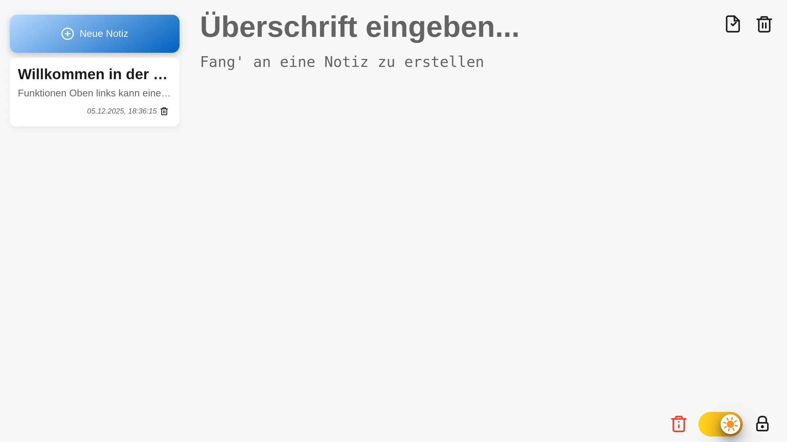

# 📝 Notiz-App (Persistent Storage)

Eine funktionale Web-Anwendung zur Verwaltung von Notizen, die direkt im Browser gespeichert werden. Dieses Projekt fokussiert sich auf effiziente DOM-Manipulation und die Nutzung der Web Storage API.

[](https://frederikanspach.github.io/notiz-app/)

<picture>
  
</picture>

## 🚀 Übersicht

Die App ermöglicht es, Notizen zu erstellen, zu bearbeiten und dauerhaft zu speichern. Dank Responsive Design und Theme-Support bietet sie eine konsistente User Experience auf allen Endgeräten.

### 🛠 Tech-Stack

- **Frontend:** HTML5, CSS3 (Liquid Glass Effekt, Flexbox)
- **Logik:** JavaScript (Vanilla JS, ES6 Modules)
- **Speicherung:** LocalStorage API (für Datenpersistenz ohne Datenbank)
- **Security Feature:** Integrierte ROT13-Verschlüsselung zur einfachen Unkenntlichmachung von Inhalten.

### ✨ Key Features

- **Full CRUD:** Erstellen, Lesen, Aktualisieren und Löschen von Notizen (Create, Read, Update, Delete).
- **Daten-Persistenz:** Notizen bleiben auch nach dem Schließen des Browsers erhalten.
- **Auto-Focus & UX:** Intelligente Fokus-Steuerung bei der Eingabe und Bestätigungsdialoge vor dem Löschen.
- **Liquid Glass UI:** Modernes Sidebar-Design mit Unschärfe-Effekten (Backdrop-Filter).
- **Theme-Switch:** Umschalter zwischen Light- und Dark-Mode mit automatischer Systemerkennung.

## 💡 Technische Highlights

- **Dynamisches Rendering:** Die Notizliste wird bei jeder Änderung effizient neu generiert und nach Aktualisierungsdatum sortiert.
- **Event-Delegation:** Sicherer Umgang mit Event-Listenern, insbesondere beim dynamischen Erstellen von Lösch-Buttons innerhalb der Liste.
- **State Management:** Konsistente Synchronisation zwischen dem internen `noteArray` und dem `localStorage`.

## 🛠 Installation & Nutzung

## 🛠 Installation & Nutzung

1. Repository klonen:

   ```bash
   git clone [https://github.com/frederikanspach/notiz-app.git](https://github.com/frederikanspach/notiz-app.git)

   ```

2. Die index.html im Browser öffnen. Es ist kein Build-Prozess notwendig (Pure Vanilla JS).
